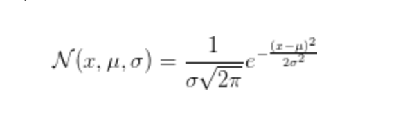
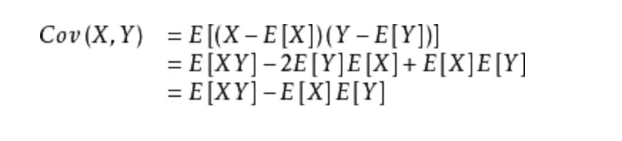
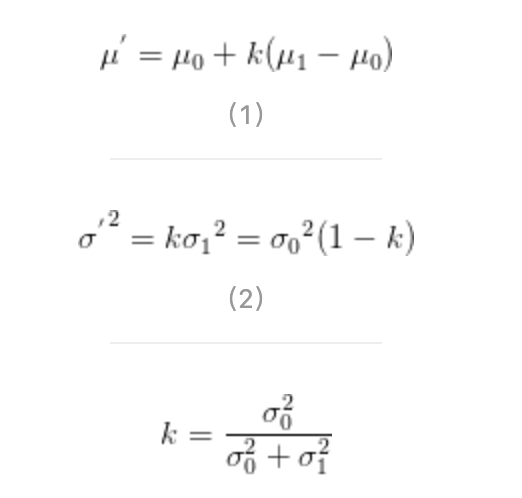
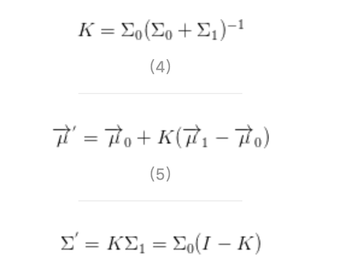
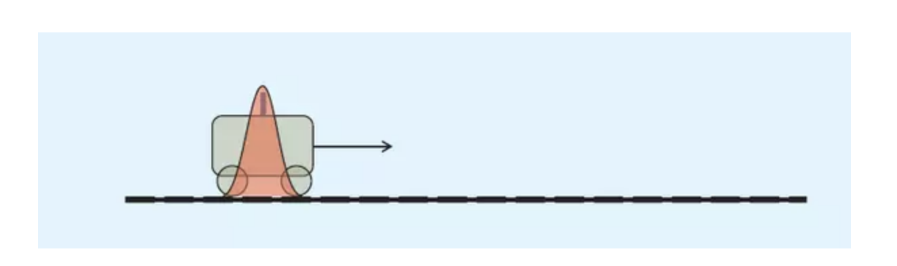
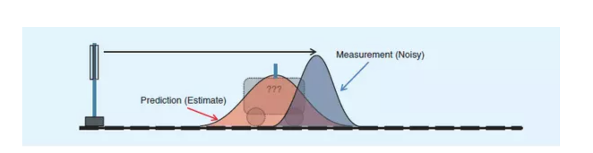
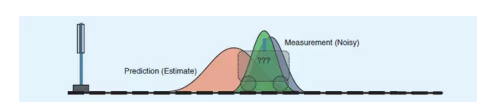

##卡尔曼滤波

###一、数学原理
- 正态分布密度函数

- 协方差

- 两个正态密度函数相乘的结果

- N个正态密度函数相乘的结果

###二、卡尔曼滤波的通俗理解
卡尔曼滤波适用于估计一个由随机变量组成的动态系统的最优状态。

假设存在一辆小车在运动，我们需要知道它的运动状态，可以通过建立一个向量来存储汽车的位置和速度x(t)=(p,v)，对于小车我们就采用位置和速度来描述，它在时刻t的状态向量x(t)只与x(t-1)相关：比如：x(0)表示小车在t=0时刻的状态是：速度大小5m/s,速度方向右,位置坐标0。反正有了这个向量就可以完全预测t=1时刻小车的状态。因为X(t)=Fx(t-1)，那么根据t=0时刻的初值x(0)，理论上我们可以求出它任意时刻的状态。

但是实际上这个递推函数会受到各种不确定因素的影响，比如天气，路况等。我们假设每个状态受到的不确定影响为正态分布。

- **EXAMPLE**

我们首先看最简单的一维情况：假设小车速度均值为2cm/s，我们只用位置表示小车的状态，即只对小车位置进行估计。此时把二维向量简化为标量。

t=k-1时小车的位置服从红色的正态分布。假设位置在21cm，位置误差为0.3cm，即μ=21，σ=0.3

我们可以根据位置与速度经验公式，预测出t=k时刻它的位置：位置均值是21+2=23cm，我对自己速度预测不确定度为0.4cm，那么此时小车位置预测误差为0.5cm（0.5是这样得到的：如果k-1时刻估算出的最优位置的偏差是0.3，你对自己预测的不确定度是0.4，他们平方相加再开方，就是0.5，为什么是这样？用了正态分布的线性叠加定理，即位置和速度两正态分布的和也满足正态分布，方差是二者平方 ）。可以看出0.5>0.3，此时分布变“胖”了，这很好理解——因为在递推的过程中又加了一层噪声（即预测不稳定度），所以不确定度变大了

为了避免纯估计带来的偏差，我们在t=k时刻对小车的位置坐标进行一次雷达测量，当然雷达对小车距离的测量也会受到种种因素的影响，会带来测量误差，这个测量误差的均方差是0.4cm，假设此时测量值是25cm(即均值为25)。而且测量结果也复合正态分布，于是可以画出小车在t=1时的位置服从蓝色分布

**两个事件的发生都是概率性的，不能完全相信其中的任何一个！如果我们具有两个事件，从直觉或者是理性思维上讲，是不是认定两个事件都发生，就找到了那个最理想的估计值？好了，抽象一下，得到：两个事件同时发生的可能性越大，我们越相信它！要想考察它们同时发生的可能性，就是将两个事件单独发生的概率相乘**

**卡尔曼理论上证明了，绿色分布不仅保证了在红蓝给定的条件下，小车位于该点的概率最大，而且，它居然还是一个正态分布,正态分布就意味着，可以把它当做初值继续往下算了！这是Kalman滤波能够迭代的关键**

由于我们用于估算k时刻的实际位置有两个位置值，分别是23cm和25cm。究竟实际位置是多少呢？相信自己预测还是相信雷达测量呢？究竟相信谁多一点，我们可以用kalman的方法来加权，即利用他们的方差σ^2来判断，求出绿色分布均值位置在红蓝均值间的比例，即Kalman增益Kg。

根据数学上两正态分布相乘仍然是正态分布，由公式(3)得到Kg=0.5^2/(0.5^2+0.4^2)，所以Kg=0.61。（注意kg是方差的概念，不是均方差，网上很多文献kg用错，开了根号，得到0.78）我们可以估算出k时刻的实际位置是：23+0.61*(25-23)=24.22cm，见公式(1)。可以看出，
**因为雷达的方差比较小（比较相信雷达），所以估算出的最优位置值偏向雷达测量的值**。

现在我们已经得到k时刻的最优位置值了，下一步就是要进入k+1时刻，进行新的最优估算。到现在为止，好像还没看到什么自回归的东西出现。对了，在进入k+1时刻之前，我们还要算出k时刻那个最优值（24.22cm）的偏差。算法如下：((1-Kg)*0.5^2)^0.5=0.312，见公式(2)。这里的0.5就是上面的k时刻你预测的那个23cm位置的均方差，得出的0.312cm就是进入k+1时刻以后k时刻估算出的最优位置值的均方差（对应于上面的0.3cm），
**于是我们可以把绿色分布当做第一张图中的红色分布对t=k+1时刻进行预测**，算法就可以开始循环往复了。

说明一下，由于上面我们只对小车位移这个一维量（向量）做了估计，因此Kalman增益是标量。如果状态向量是多维，那么方差就该变为协方差，从而引入协方差矩阵的迭代，Kalman增益也变成了矩阵。需要采用公式(4)-(6)来求解Kalman增益矩阵和k时刻的最优值和协方差矩阵。无论是多少维的向量空间，上面描述给出了**Kalman滤波算法的本质就是利用两个正态分布的融合仍是正态分布这一特性进行迭代而已**。

 

- [参考：我所理解的卡尔曼滤波](https://www.jianshu.com/p/d3b1c3d307e0)